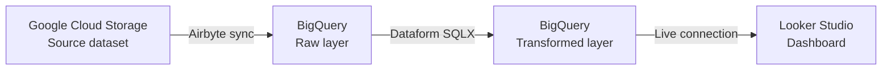

# Toy Store ELT Pipeline — Maven Fuzzy Factory

An end-to-end data engineering and analytics project built around the Maven Fuzzy Factory toy store dataset. The pipeline covers the full modern data stack: cloud storage, automated ingestion, SQL transformation, scheduled execution, and business intelligence visualization.

---

## Overview

This project demonstrates a production-style ELT (Extract, Load, Transform) pipeline using Google Cloud Platform and open-source tooling. Raw transactional data from a toy store (orders, sessions, products, refunds) is stored in Google Cloud Storage, ingested into BigQuery via Airbyte, transformed into analytical models using Dataform, and visualized through a Looker Studio dashboard.

The project is intended as a portfolio demonstration of modern data engineering practices including version-controlled SQL transformations, automated scheduling, and layered data modeling.

---

## Architecture



The pipeline follows the ELT pattern:

- **Extract and Load** — Airbyte reads CSV files from Google Cloud Storage and loads them into BigQuery as raw tables without transformation.
- **Transform** — Dataform applies SQL-based transformations directly inside BigQuery, building staging models and analytical marts.
- **Visualize** — Looker Studio connects to the transformed BigQuery tables and serves the final dashboard.

---

## Tech Stack

| Layer | Tool | Purpose |
|---|---|---|
| Source storage | Google Cloud Storage | Hosts the raw Maven Fuzzy Factory CSV/SQL dataset files |
| Ingestion | Airbyte | Automated connector that syncs data from GCS into BigQuery |
| Data warehouse | Google BigQuery | Central storage for both raw and transformed data layers |
| Transformation | Dataform | Git-native SQL transformation framework running inside BigQuery |
| Scheduling | Dataform (built-in) | Manages pipeline execution and dependency resolution |
| Visualization | Looker Studio | Business intelligence dashboard connected to BigQuery |

---

## Repository Structure

```
toy-store-elt-airbyte/
├── Maven+Fuzzy+Factory/       # Source dataset — MySQL toy store schema files
├── definitions/               # Dataform SQLX model definitions (staging and marts)
├── includes/                  # Dataform JavaScript helper constants and functions
├── airbyte.zip                # Exported Airbyte connector and sync configuration
├── workflow_settings.yaml     # Dataform project settings (dataset, core version)
├── .gitignore
└── README.md
```

### Key files explained

`workflow_settings.yaml` — Defines the Dataform project name (`data-engineering-airbyte-elt`), default dataset (`dataform`), assertions dataset (`dataform_assertions`), and Dataform core version (`3.0.35`).

`definitions/` — Contains `.sqlx` files that define each transformation model. Models in this folder reference raw BigQuery tables produced by Airbyte and output cleaned, joined, or aggregated tables used by Looker Studio.

`includes/` — Contains reusable JavaScript snippets such as shared constants or macro-like functions that can be referenced across multiple `.sqlx` files.

`Maven+Fuzzy+Factory/` — The source data representing a fictional e-commerce toy store. The dataset includes tables for website sessions, orders, order items, products, and refunds. This is the upstream data that Airbyte pulls from GCS.

`airbyte.zip` — An exported configuration from Airbyte containing the source connector (GCS), destination connector (BigQuery), and sync settings. This file allows the Airbyte setup to be reproduced without manual UI configuration.

---

## Pipeline Walkthrough

### Step 1 — Source data in Google Cloud Storage

The Maven Fuzzy Factory dataset files are uploaded to a Google Cloud Storage bucket. Each file corresponds to one logical table in the toy store schema (sessions, orders, products, etc.). GCS acts as the staging area before data enters the warehouse.

### Step 2 — Ingestion with Airbyte

Airbyte is configured with a Google Cloud Storage source connector and a BigQuery destination connector. When a sync is triggered, Airbyte reads the files from GCS and loads them as raw tables into a designated BigQuery dataset. The Airbyte connection settings are stored in `airbyte.zip` for reproducibility.

### Step 3 — Raw layer in BigQuery

After ingestion, BigQuery holds the raw tables that mirror the structure of the source files. No transformations have been applied at this point. The raw layer serves as the single source of truth before any business logic is introduced.

### Step 4 — Transformation with Dataform

Dataform runs SQL transformations directly inside BigQuery using `.sqlx` files stored in the `definitions/` folder. The `workflow_settings.yaml` file defines the project context. Dataform handles dependency resolution between models, so downstream models are only executed after their upstream dependencies have completed successfully. Assertions in the `dataform_assertions` dataset are used to validate data quality.

### Step 5 — Visualization in Looker Studio

Looker Studio connects directly to the transformed BigQuery tables via a live data source. The dashboard surfaces key toy store metrics such as session volume, conversion rates, revenue by product, and refund trends.

---

## Prerequisites

Before running this project, you need the following:

- A Google Cloud Platform account with a project created
- A Google Cloud Storage bucket containing the Maven Fuzzy Factory dataset files
- A BigQuery dataset to receive the raw data from Airbyte
- An Airbyte instance (Cloud or self-hosted) with access to GCS and BigQuery connectors
- A Dataform workspace linked to this repository and connected to your BigQuery project
- A Looker Studio account with permission to connect to BigQuery

---

## Setup and Reproduction

**1. Configure Airbyte**

Extract the `airbyte.zip` file and import the connector configuration into your Airbyte instance. Update the GCS bucket path and BigQuery project/dataset values to match your environment. Run a manual sync to confirm raw tables appear in BigQuery.

**2. Configure Dataform**

Connect this repository to a Dataform workspace in Google Cloud. Update `workflow_settings.yaml` if you need to use a different BigQuery project or dataset name. Trigger a Dataform execution to build the transformation models.

**3. Connect Looker Studio**

Create a new Looker Studio report and add the transformed BigQuery tables as data sources. Build or import the dashboard using the available dimensions and metrics.

---

## Data Source

This project uses the **Maven Fuzzy Factory** dataset, a fictional e-commerce MySQL database designed for data analytics training. The dataset simulates real toy store operations including web sessions, orders, products, and customer behavior. Credit to Maven Analytics for making this dataset publicly available.

---

## Notes

- This is a personal portfolio project and is not intended for production use.
- The `airbyte.zip` file does not contain credentials. You will need to supply your own GCP service account keys when setting up the connectors.
- Dataform version used in this project is `3.0.35` as specified in `workflow_settings.yaml`.
